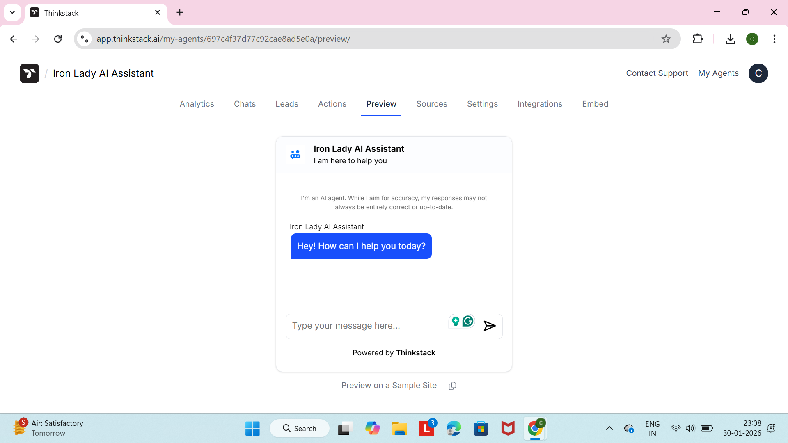
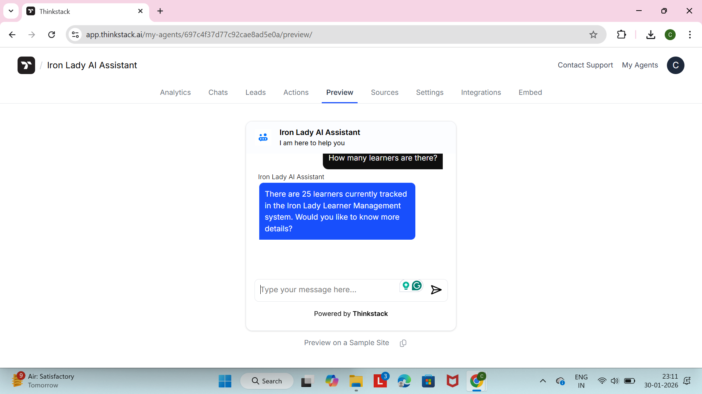

# Iron Lady – AI Solutions

## Overview
This repository contains two AI-powered solutions designed for Iron Lady to improve:
- Customer interaction and engagement
- Internal learner management and operational efficiency

These solutions were built after studying Iron Lady’s business model, programs, target audience, and learner journey.

---

## Task 1: AI-based Customer Interaction Solution

### Problem Identified
Prospective learners visiting Iron Lady’s website need quick, clear answers about:
- Programs offered
- Enrollment process
- Learner journey
- Follow-ups and support

Manual responses increase workload and delay user engagement.

### Solution
An AI-powered chatbot called **Iron Lady AI Assistant** that:
- Answers questions about Iron Lady’s programs
- Guides users through the learner journey
- Responds instantly 24/7
- Improves engagement and reduces manual effort

### How AI is Used
- Natural language understanding to answer user queries
- Knowledge trained using Iron Lady’s website content
- Context-aware responses to learner questions

### Tools Used
- Thinkstack AI (Chatbot Builder)
- Iron Lady website as a training source
  
### Screenshots – Task 1: AI Customer Interaction

---

## Task 2: Internal Business Automation Solution

### Problem Identified
Managing learner data manually (status tracking, follow-ups, enrollment progress) is time-consuming and error-prone.

### Solution
A simple internal learner management system that supports:
- Creating learner records
- Viewing learner data
- Updating learner status (Applied, Enrolled, Completed)
- Tracking follow-ups

This demonstrates a complete **CRUD flow**.

### How AI is Used
- AI answers operational questions like:
  - How many learners are enrolled?
  - Who has completed the program?
  - What is the status of a specific learner?
- Converts spreadsheet-based data into intelligent responses

### Tools Used
- Google Sheets (data storage)
- Thinkstack AI (Q&A-based AI logic)
  
### Screenshots – Task 2: Internal Business Automation

---

## Demo Videos
Two demo videos (2–3 minutes each) demonstrate:
- Problem identification
- Solution walkthrough
- AI usage in real-world scenarios
## 🎥 Demo Videos (Google Drive)

Task 1 – AI-based Customer Interaction (Chatbot Demo):  
👉 https://drive.google.com/file/d/1v-8H6VrbdjtsN-hi6yY3Nf3W10P-Dks9/view?usp=drive_link
Task 2 – Internal Business Automation (CRUD + AI):  
👉 https://drive.google.com/file/d/1iE2eXRrJZPBSVZnorQZmmEue_Fv9s9Fr/view?usp=drive_link

---

## Author
Chandrika  
AI Assignment Submission – Iron Lady
